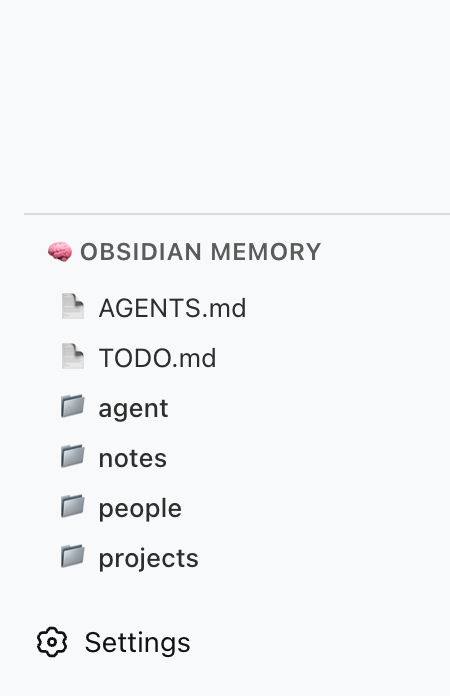

# dsh-client-ui-obsidian-memory

> 🧠 DeepSeek Harness 的 Obsidian Memory 侧边栏插件

一个 DSH 客户端插件，在左侧边栏渲染 Obsidian Codex 知识库的文件树浏览器，通过本地预览服务器读取你的 vault。

灵感来自 [@Saccc_c](https://x.com/Saccc_c) 的 Codex 记忆技巧。



---

## 功能

- **侧边栏面板** — 在 DSH 左侧边栏的 `sidebar.obsidian-memory` 插槽中渲染
- **实时文件树** — 从本地预览服务器（默认端口 `3456`）拉取 vault 文件树
- **点击浏览** — 展开/收起文件夹，查看 markdown 文件
- **离线兜底** — 预览服务器未启动时，显示硬编码的 vault 骨架结构

---

## 快速开始

### 1. 安装插件

```bash
cd /path/to/deepseek-harness
npm install dsh-client-ui-obsidian-memory
# 或
pnpm add dsh-client-ui-obsidian-memory
```

在 `cordis.patch.yml`（或 `cordis.yml`）中添加：

```yaml
- id: ui-obsidian-memory
  name: dsh-client-ui-obsidian-memory
```

> **前置条件**：`ui-sidebar` 必须声明 `sidebar.obsidian-memory` 子插槽。DSH ≥ 0.1.0-rc.5 已包含。如果你的版本尚未支持，见下方「手动补丁」节。

然后重新构建并重启：

```bash
npm run build:web
dsh web
```

### 2. 启动预览服务器

预览服务器读取本地 vault 并通过 HTTP 暴露。

```bash
cd dsh-obsidian-memory/mcp-server
npm install && npm run build
node dist/preview-server.js --vault /path/to/your/Obsidian/Codex
```

默认端口 `3456`。面板会在页面加载时自动连接。

---

## 架构

```
┌─────────────────────────────┐
│ DSH Web (端口 3080)         │
│  ┌───────────────────────┐  │
│  │ sidebar.obsidian-memory│  │
│  │  ┌─────────────────┐  │  │
│  │  │ 🧠 Obsidian     │  │  │
│  │  │    Memory 面板  │  │  │
│  │  └─────────────────┘  │  │
│  └───────────────────────┘  │
└──────────┬──────────────────┘
           │ fetch /api/tree
┌──────────▼──────────────────┐
│ Preview Server (端口 3456)  │
│ (本仓库的 mcp-server/)      │
└──────────┬──────────────────┘
           │ 读取文件系统
┌──────────▼──────────────────┐
│ Obsidian Vault / Codex/     │
└─────────────────────────────┘
```

| 组件 | 职责 |
|------|------|
| **DSH 插件** (`dsh-client-ui-obsidian-memory`) | 浏览器端：侧边栏面板、文件树渲染 |
| **预览服务器** (`mcp-server/`) | Node 端：读取本地 vault，提供 `/api/tree` HTTP API |
| **Obsidian Vault** | 数据源：Markdown 文件 + 文件夹 |

---

## 故障排查

| 现象 | 原因 | 解决 |
|------|------|------|
| 面板显示 "Preview server offline (port 3456)" | 预览服务器未启动 | 运行 `node dist/preview-server.js --vault <路径>` |
| 面板完全不出现 | 插槽未注册 | 确认 `cordis.patch.yml` 包含 `ui-obsidian-memory` 行 |
| 文件树为空 | vault 路径错误或目录为空 | 检查 `--vault` 指向的是 `Codex/` 文件夹 |
| 点击文件无反应 | `window.dshOpenFile` 未注入 | 已知限制，需 DSH 提供文件打开 API |

---

## 手动补丁（如果你的 DSH 尚未支持该插槽）

如果你的 DSH 版本还没有 `sidebar.obsidian-memory` 插槽声明，给 `ui-sidebar` 打以下补丁：

**`packages/client/ui-sidebar/src/client/contract/slots.ts`**

在 `SlotMap` 中添加：

```ts
'sidebar.obsidian-memory': { kind: 'single'; scope: 'root'; owner: ObsidianMemoryOwnerProps }
```

并添加接口：

```ts
export interface ObsidianMemoryOwnerProps {
  wide: boolean
}
```

**`packages/client/ui-sidebar/src/client/SidebarRoot.tsx`**

在 `regionArea` div 之后插入：

```tsx
{wide && (
  <div className={css.regionArea} style={{ flex: '0 0 auto', maxHeight: '280px', overflow: 'auto' }}>
    {renderSlot('sidebar.obsidian-memory', { wide })}
  </div>
)}
```

然后重新构建 `ui-sidebar` 和 `web`。

---

## 关联：Codex 记忆系统

这个插件本身只负责**展示**你的 Obsidian vault。要让 AI 真正「记住」内容，你需要在 vault 中维护以下结构：

```
Codex/
├── AGENTS.md          # AI 的操作说明书
├── TODO.md            # 待跟进事项
├── agent/
│   └── open-loops.md  # 尚未收尾的工作
├── notes/             # 随手笔记
├── people/            # 关键人物信息
└── projects/          # 项目状态
```

DSH 的 system prompt 或 agent preset 可以引用 `AGENTS.md`，告诉 AI 如何读写这个记忆库。

---

## 开发

```bash
git clone https://github.com/detongz/dsh-client-ui-obsidian-memory.git
cd dsh-client-ui-obsidian-memory/plugin
npm install
npm run build        # 输出 lib/client.js
npm run watch        # 开发模式自动重建
```

构建产物说明：
- `lib/index.js` — host 入口（空实现，DSH 要求）
- `lib/client.js` — browser bundle（DSH closure-factory 格式，CSS 内联）

---

## 许可证

MIT
